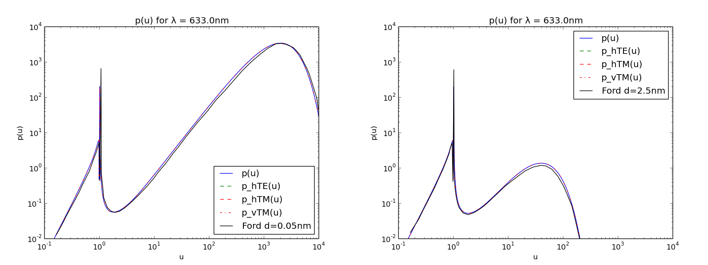
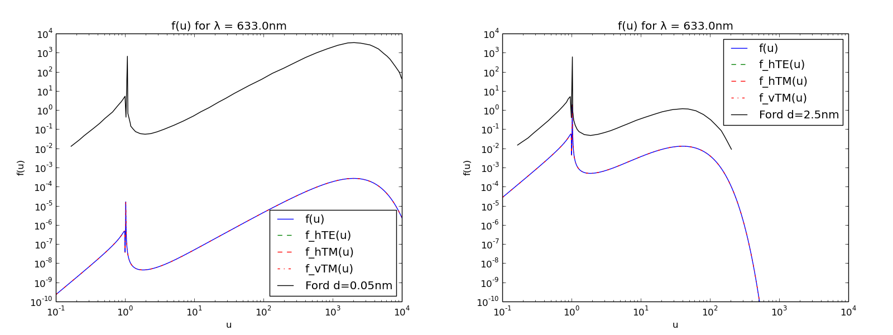

Powerdensity of a Single Emitter in Front of Silver
===================================================

.. contents::
   :local:

Overview
--------

In this example the angular distribution of the emitted power of a single monochromatic dipole emitter above a silver surface is calculated and compared to published data.

Demonstrated tasks
++++++++++++++++++
:samp:`dipolestudy`

The setting and results are published in :cite:`Ford1984` where we aim to reproduce Figure 4 (dashed lines).
The paper discusses in detail different models to describe reflection of electromagnetic waves.
As LIGHTPILE uses the model of local media we restrict our discussion to these results.
The solid lines in Figure 4 are the result of a calculation using other non-local models.

We will use LIGHTPILE to produce a graph showing the same quantities as in Figure 4 of :cite:`Ford1984`.
To compare the data you can find graphically extracted datapoints from Figure 4 for both emitter distances in the example directory.
We can use LIGHTPILE to overlay these datapoints onto the generated graph to compare the external datapoints with LIGHTPILE generated data.

Setting the stack
-----------------
To describe the situation to simulate to LIGHTPILE we can use the sections :samp:`materials`, :samp:`emitters` and :samp:`stack` in the configuration file.

The vertically aligned dipole is placed in air (:math:`\hat{n}=1.0`) with a distance :math:`d_1=0.05\,nm` (:math:`d_2=2.5\,nm`) above a silver surface with optical index :math:`\hat{n}_{Ag}=0.0767-4.366i` [#f1]_ .::

    [materials]
    # format: <materialname> <(<n> [k])|<path_to_nk_file>>
    ag      0.0767  4.366
    air     1.

    [emitters]
    # format: <emittername> <vert|hor|iso> <IQE>
    green   vert  1.0

    [stack]
    # format: <(<materialname> <thickness in nm>)|<emittername>>
    air     0
    green
    air     0.05
    ag      200

.. _result-quantities-label:

Result quantities
-----------------
The radiation emitted by a dipole in a planar stack is dependent on the azimutal angle :math:`\theta` of the wavevector :math:`\v k` of the emitted radiation.
It is often easier and conceptually more general to use the component of the wave vector parallel to the surfaces of the planar stack, named :math:`q` (transverse wavevector).
The azimutal angle is related to :math:`q` by

.. math::  \sin \theta = q/\abs{\v k}

To have a quantity independent of the wavelength LIGHTPILE uses the normed transverse wavevector

.. math:: u = \frac{q}{k_{vac}}

Using :math:`u` to describe the direction of the radiation we can quantify the emitted power per direction (the powerdistribution) as :math:`\frac{\dd P}{\dd u}`.
As the power of dipole is strongly dependent on its wavelength (or frequency) it is again convinient to norm this power.
As we know the emission power a free dipole in vacuum to be [#f2]_

.. math:: P_0 = \frac{c_0 p^2 k_{vac}^4}{12 \pi \epsilon_0}

we can use it to define the normed powerdistribution

.. math:: p = \frac{1}{P_0} \frac{\dd P}{\dd u}

With known powerdistribution :math:`p(u)` the total power emitted by a dipole emitter within a planar stack is therefore

.. math:: P = P_0 \int_0^{\infty} p(u) \dd u
   :label: integrated_powerdensity

This powerdistribution :math:`p(u)` is shown in Figure 4 of :cite:`Ford1984` although it is named :math:`\frac{k_1}{P_{free}} \frac{\dd P}{\dd p}` and the normed transverse wavevector :math:`u` is named :math:`p/k_1`.

Configuration
-------------

LIGHTPILE explicitly calculates the powerdistribution of a single dipole emitter with the :samp:`dipolestudy` task. It requires information about the wavelength, frequency or energy of the dipole (:samp:`spectralpoint`) and the range of the transverse wavevector (:samp:`angularrange`). ::

    [dipolestudy]
    spectralpoint wavelength nm 633
    angularrange u None 0.1 1e4 1000 log

The wavelength of :math:`\lambda=633\,nm` is equivalent to the given energy of :math:`E=1.96\,eV`.

The result data is presented in text form and as a graph.
The graph of the powerdistribution :math:`p` versus angular data is named :samp:`graph_p_a` and can be configured in the section :samp:`[graph_p_a]` in the configfile::

    [graph_p_a]
    yscale log     # format: yscale <log|linear>
    lines all      # format: lines <all|total>
    xlim 0.1 1e4   # format: xlim <xlim_left> <xlim_right>
    ylim 1e-2 1e4  # format: ylim <ylim_bottom> <ylim_top>
    # format: externaldata <path_to_datapoint_file> [label]
    externaldata "examples/ex_ford1984/ford1984_fig4a.dat" "Ford d=0.05nm"

Results
-------

Finishing the calculation LIGHTPILE will write its output to the current working directory (the one from where LIGHTPILE was called).
The :samp:`dipolestudy` task produces four outputs:

* textfile :samp:`dipolestudy_data_p.txt`
* textfile :samp:`dipolestudy_data_f.txt`
* image :samp:`dipolestudy_graph_p.png`
* image :samp:`dipolestudy_graph_f.png`

The textfiles include all the data used to generate the graphs.
Additionally important parameters and not visualized results are included.
The format should allow an easy import into other data manipulation or visualization programs.

We will shortly discuss the angular powerdistribution result :math:`p(u)`. The emission propability :math:`f(u)` is discussed in section :ref:`powerdensity-vs-emission-propability-density-label`.

Running LIGHTPILE twice for both emitter distances :math:`d` we get graphs as shown in Figure~\ref{fig:fig4}.
The blue line represents the total powerdensity emitted :math:`p(u)`.
Also shown are the individual contributions from vertically or horizontally oriented dipoles for both polarizations.
As our simulation contains a vertical dipole only, the total :math:`p(u)` is identical to the slash-dotted red :math:`p_{\text{vTM}}(u)`.
With the command :samp`externaldata` we imported and overlayed the data from :cite:`Ford1984` as black line.
The calculated and imported data matches up to a small offset.
This is because we do not have access to the numeric data of :cite:`Ford1984` but had to rely on graphical extraction which introduces systematic and random errors.

Let us now discuss the plot of :math:`p(u)`: Different ranges of the normed transversal wavevector :math:`u` are associated with different kind of modes.
For :math:`0<u<n_{air}=1` the power is emitted as radiative modes with emission angles in air of :math:`0` up to :math:`90^{\circ}`.
Modes with :math:`u>n_{air}=1` are bound to the planar stack in different ways.
In our case of a free emitter in front of a metallic interface we do not have any waveguide modes.
The peak at :math:`u \ge 1` is associated with the excitation of a surface plasmon-polariton mode at the silver-air interface.
The emitted power is transported along the silver surface and dissipated due to losses in the metal although these losses are not required for the existance of the plasmon mode.
The very broad and high exitation beyond :math:`u > 10` is due to dissipation effects in the metal and can be attributed to lossy surface waves.

As discussed in :cite:`Ford1984` the model of complex refractive indexes as a local response of the material to electromagnetic excitation is becoming less usefull for highly evanescent waves and not valid in the range of :math:`u \gg n`.
Nevertheless we see LIGHTPILE correctly calculating the powerdistribution within the local model.
To stay within the range of the local model emitters should be placed at distances :math:`d>\lambda/50` of metal interfaces.

   Powerdistribution :math:`p(u)` for different emitter distances

   Powerdistribution :math:`p(u)` for a vertically oriented dipole emitter above a silver interface as described in :cite:`Ford1984`. The black lines represent the graphically extracted data of :cite:`Ford1984`. The limited accuracy of graphical extraction explains the slight offset to the LIGHTPILE caluclated lines. Only TM polarized radiation is seen as a vertical dipole does not emit TE polarized radiation.

.. _powerdensity-vs-emission-propability-density-label:

Powerdensity vs emission propability density
--------------------------------------------

In this section we are going to discuss the emission propability density :math:`f(u)` as shown in :samp:`graph_f_a` or returned in the textfile :samp:`dipolestudy_data_f.txt` and its meaning in relation to the powerdensity :math:`p(u)`.
This is important because in the field of excited emitters in thin film stacks :math:`f(u)` is often more valueable as :math:`p(u)` can be misleading.

Definition of emission propability density
++++++++++++++++++++++++++++++++++++++++++

As discussed in section :ref:`result-quantities-label` and given in :eq:`integrated_powerdensity` the total emitted power of a dipole emitter is variable, depending on :math:`p(u)` which itself depends on the stack and therefore the optical environment.
That implies that a dipole antenna close to a metal surface emits more power than the same dipole antenna in free air.
This is possible because the derivation of :math:`p(u)` assumes a forced oscillation of a dipole with constant amplitude.

If we use this model to simulate the decay of exitonic states, as in LEDs, OLEDs or quantum dots we have to account for important differences.
Excitonic emission is a stochastic process and it is easily understood that the total emitted power has an upper limit in the injected electric power of the electronic charge carriers.
The influence of the optical environment on the emission propability of an emitter or its rate :math:`\Gamma_{\text{rad}}` is known as the Purcell Effect.
An excited quantum emitter near a metallic surface does not emit more power, but its propability of emission is higher.
Its rate of radiative emission is increased while possible nonradiative decay is assumed to be unaffacted.

The classical dipole model is connected with the quantum picture by the assumption that the propability for photon-emission is proportional to the total emitted power of the classical dipole :math:`P`.

.. math:: \Gamma_{\text{rad}} = \frac{P}{P_0} \Gamma^0_{\text{rad}}

With the inclusion of nonradiative decays with the rate :math:`\Gamma_{\text{nrad}}`, assumed to be independent of the optical environment, the total decay rate

.. math:: \Gamma = \Gamma_{\text{nrad}} + \frac{P}{P_0} \Gamma^0_{\text{rad}}

and the effective radiative quantum yield

.. math:: \eta_{\text{rad}} = \frac{ \frac{P}{P_0} \eta^0} {1-\eta^0 + \frac{P}{P_0}\eta^0}

is obtained.
The only unknown parameter is the emitter dependent intrinsic radiative quantum yield :math:`\eta^0` or intrinsic quantum efficiency IQE.

We define the emission propability density :math:`f` as

.. math:: f(u) = \frac{\eta_{\text{rad}}}{P} \frac{ \dd P}{\dd u} = \frac{p(u)}{\left( \frac{1-\eta^0}{\eta^0} + \frac{P}{P_0} \right) }
   :label: eq_def_f

so that :math:`\int_0^\infty f(u) \dd u = \eta_{\text{rad}}`.

Discussion
++++++++++

In the definition of :math:`f(u)` in :eq:`eq_def_f` we can see that it differs from :math:`p(u)` only by a norming factor.
This norming factor :math:`\eta_{\text{rad}} \frac{P_0}{P}` expresses the difference of a constant amplitude emitter and a stochastic quantum emitter.

Let us compare the two cases of :cite:`Ford1984` with emitter distances of :math:`d_1=0.05\,nm` and :math:`d_2=2.5\,nm`.
We are interested in the brightness of the two emitters as seen from any angle in the air halfspace and use Fig. :ref:`fig_f_comparison` with :math:`f(u)` shown in blue and :math:`p(u)` shown in black.

Due to the extreme coupling of evanescent waves to the lossy surfacce modes in the case of small distances of the emitter to the metal the integral :math:`P/P_0 = \int_0^{\infty}p(u)\dd u` is increased dramatically.
:math:`P/P_0 \sim 1.25e7` for the case :math:`d_1` (left) while only :math:`P/P_0 \sim 105` in the case of :math:`d_2` (right).
In the picture of constant amplitude dipoles the former would bear a huge strain on its external power supply but appearing with equal brightness compared to the later for an external observer.
This is expressed by :math:`p(u)` being equal in the radiative mode range (:math:`0<u<1`).
If we compare the observation of two ensembles of exitonic emitters excited by a constant supply of charge carriers there would be a difference of around five magnitudes for an external observer as can be seen by the dramatically reduced emission propability density :math:`f(u)`.

It should be noted that :math:`p(u)` is much easier to calculate than :math:`f(u)`. To determine the norming factor needed for :math:`f(u)` we have to calculate :math:`p(u)` at every positive :math:`u` to find the integral :math:`\int_0^{\infty} p(u) \dd u`. As this job can never be truely accomplish we have to rely on reasonably good estimates.

We should keep in mind that both quantities :math:`p(u)` and :math:`f(u)` have their uses but in the case of excitonic emitters the emission propability density is less misleading.

.. _fig_f_comparison:

   comparison of :math:`f` for different emitter distances

   The emission propability density :math:`f(u)` (blue line) for radiative modes (:math:`0<u<1`) is dramatically reduced for decreased distance to the silver film (left) compared to the greater distance (right). In contrast the emitted power density :math:`p(u)` (black line) is unaffected. The change in the emission propablity density shows the expected effect of quenching near metal interfaces.

.. rubric:: Footnotes

.. [#f1] The used dielectric constant :math:`\hat{\epsilon}=-19.06+0.67i` for the silver film is taken from Fig.11 of :cite:`Ford1984`.
.. [#f2] :math:`c_0` is the speed of light in vacuum. :math:`p` is the dipole moment of the dipole. :math:`k_{vac}=2 \pi / \lambda` is the wavevector.

.. bibliography:: refs.bib
